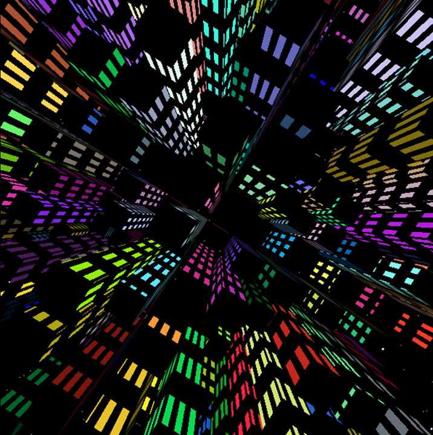
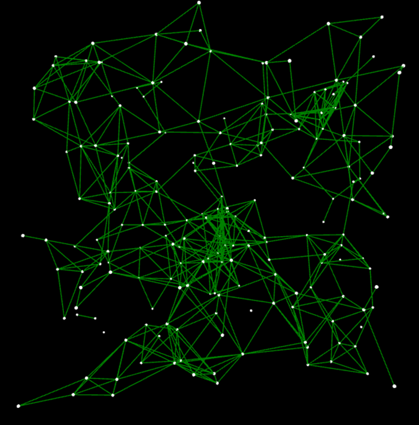
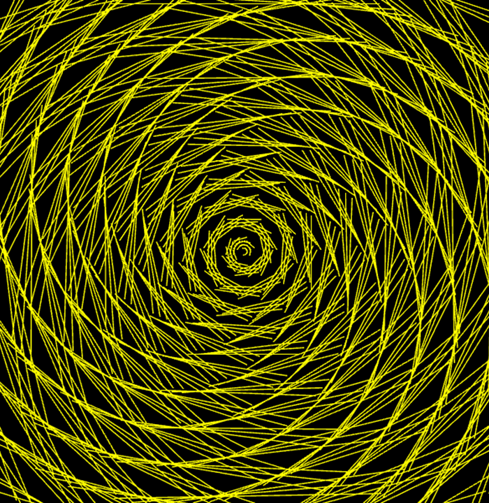
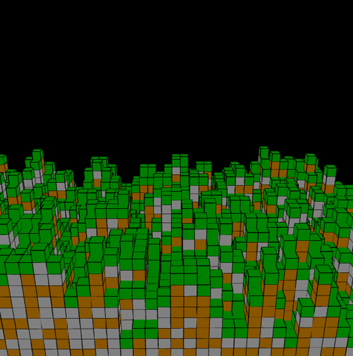
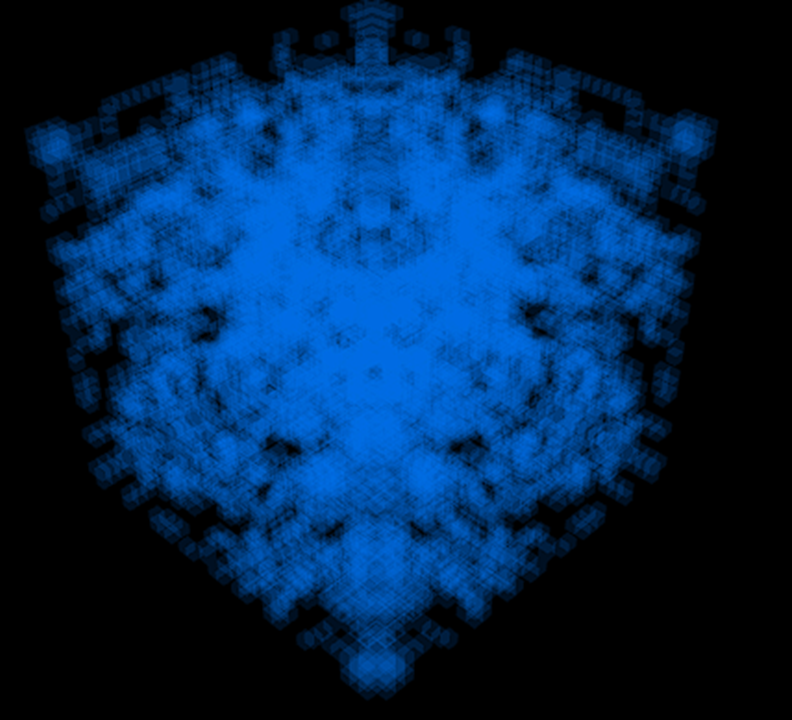
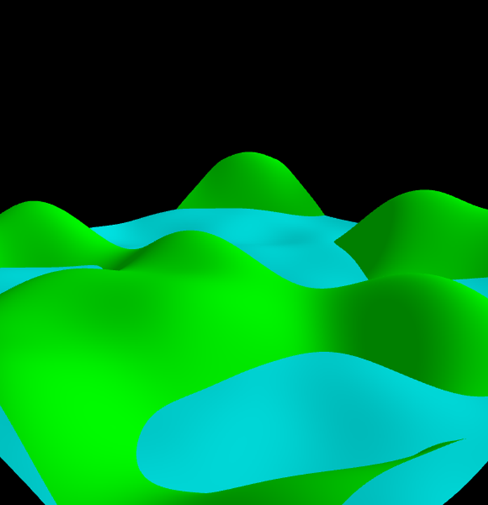

# AlgoArt Creator Studio (Simplified Version)

## Introduction
[AlgoArt.org](https://algoart.org/github/) is a digital platform that brings together Artists and Technologists to create algorithmically generated visual designs and artworks. This repository contains a simplified and light-weight version of our Creator Studio that you can use to develop your own drawing algorithms and generate your own unique artworks!

*Try out our public demo @* https://algoart.org/github/

## Videos & Talks

*Artwork Video*

*Talk & Tutorial*

## How Does It Work?

**Drawing Algorithms:** We designed a simple framework for creating drawing algorithms.  These algorithms, coded in JavaScript, are built from procedural processes that draw lines and basic shapes onto an [HTML Canvas](https://www.w3schools.com/html/html5_canvas.asp). Our example procedural processes were inspired by mathematical concepts, natural phenomena, and artistic trends.

**Algorithm Structure:** Each algorithm has two JavaScript files.  One file is for the drawing procedure and the other is for parameter configuration.  The drawing procedure is declared as a dictionary object and includes functions called *start*, *pause*, *reset*, *initialize*, and *drawOneStep*.

**Web Interface:** The web interface is used to run your drawing algorithms.  Using the web interface, a user can start, pause, or reset a drawing algorithm.  In addition, a user can also clear the canvas and save the current state of the digital canvas as an image file.

## Our Algorithms

## 2D implmentation

### algDots (Simple Example)

This is a sample drawing algorithm that is meant for viewers to understand the programming framework that is used to create a new drawing algorithm.  We encourage you to clone our repo and try modifying this code to build your own drawing algorithm.  If you do so, **please consider sharing your resulting artworks with us** and [submit a pull request](https://github.com/Algorithmically-Generated-Artwork/Drawing-Program/pulls)!

Example Drawing:

### algGP (Mike's Geometric Patterns)

This drawing program takes in over 30 different parameters representing line length, line thickness, rotation angles, color variations, background color blending, line sparsity, and whether intersecting lines are allowed. Based on these parameters and a random number generator, the drawing program generates different kinds of repeated geometric patterns. All of the generated patterns are drawn line by line on a digital canvas.

Example Drawing:

Blog Article: https://michaelwehar.wordpress.com/2022/06/16/algorithmically-generated-visual-designs-geometric-patterns/

### algVines (Alyssa's Vines)

This algorithm, called "Vines", operates by drawing a variety of shapes across a canvas following certain kinds of paths. These paths that the vines follow are determined by various mathematical formulas. In particular, there are four kinds of paths: a random path, a linear path, a spiral path, and a path determined by a sine function.

Example Drawing:

Blog Article: https://michaelwehar.wordpress.com/2022/07/23/algorithmically-generated-visual-designs-5-vines/

## 3D implementation (Umass Boston, CS410)

Goal was to implement 3D artwork onto the clients' existing UI, Creator Studio. These artworks draw onto a WebGL canvas with similar features as in 2D artworks.

### Technology
The algorithms are designed in JavaScript and drawn using Three.js on a WebGL canvas. Everything is done onto a version of the Creator Studio with no network calls, every file is accessible directly from the webpage.

## Prototypes

#### Neocity (by Jean)

#### Made using Three.js

This algorithm generates neon buildings in a city defined by the number of steps the user defines. The user can customize the maximum height of the builds, the size of the buildings, the spacing between them, and also get a scrolling effect by ticking the scrolling checkmark in the parameters. 

Example Drawing:

#### Constellation (by Jean)

#### Made using Three.js

Formally meant to be molecular, constellations took a life of its own. This algorithm is inspired by the constellations that have been created by people connecting stars to one another. The user is able to set the color, whether the stars are visible and other settings to create custom constellations that they’ll be able to share. 

Example Drawing:

#### Spiral (by Jean)

#### Made using Three.js

Spirals is a cool 2D but on a 3D plane piece of art that is made using spirals. The user can control aspects of the spirals allowing them to have varying pieces of art generated and with them being able to select their color as well, they are able to get their own spirals just how’d they like.  

Example Drawing:

#### Blockworld (by Jean)

#### Made using Three.js

Inspired by the popular video game, Minecraft, blockworld allows the user to generate these randomly generated worlds made entirely of blocks. The user is able to set the world size and the colors of the three blocks and how random the blocks are placed.

Example Drawing:

#### Conway Game of Life 3D (by Jake)

#### Made using Three.js

A 3D take on Conway’s game of life. The user sets a rule that determines whether a cube is alive or dead and by choosing which cubes are alive at the beginning, cool patterns can be created. 

Example Drawing:

#### Topographic (by Jake)

#### Made using Three.js

Generates a flat plane that has a set of vertices that can be manipulated to make the plan nonlinear. Using perlin noise we manipulate these vertices to create a topographic map that can be viewed in a 3D space. The user can set parameters such as number of vertices, as well as the frequency and max height of hills. 

Example Drawing:

## Articles & Links

*Blog Articles*

- [Wrapping Paper](https://michaelwehar.wordpress.com/2022/06/14/algorithmically-generated-visual-designs-wrapping-paper/) by Alyssa Zhang
- [Geometric Patterns](https://michaelwehar.wordpress.com/2022/06/16/algorithmically-generated-visual-designs-geometric-patterns/) by Michael Wehar
- [Overlapping Tiles](https://michaelwehar.wordpress.com/2022/07/07/algorithmically-generated-visual-designs-3-overlapping-tiles/) by Michael Wehar
- [Spiderwebs](https://michaelwehar.wordpress.com/2022/07/10/algorithmically-generated-visual-designs-4-spiderwebs/) by Maya Newman-Toker
- [Vines](https://michaelwehar.wordpress.com/2022/07/23/algorithmically-generated-visual-designs-5-vines/) by Alyssa Zhang
- [Fractals](https://michaelwehar.wordpress.com/2022/08/10/algorithmically-generated-visual-designs-6-fractals/) by Maya Newman-Toker and Michael Wehar
- [70's Funk](https://michaelwehar.wordpress.com/2022/08/10/algorithmically-generated-visual-designs-7-70s-funk/) by Michael Wehar and Alyssa Zhang
- [Game of Life](https://michaelwehar.wordpress.com/2022/08/10/algorithmically-generated-visual-designs-8-game-of-life/) by John Mancini and Michael Wehar
- [Trees](https://michaelwehar.wordpress.com/2022/08/19/algorithmically-generated-visual-designs-9-trees/) by Michael Wehar

*More Articles*

<!--- - [Algorithmically Generated Visual Art](https://alyssazhang.squarespace.com/work/algorithmically-generated-artwork) by Alyssa Zhang --->
- [AI Generated Digital Painting from Start to Finish](https://www.aiplusinfo.com/blog/ai-generated-digital-painting-from-start-to-finish/) by Michael Wehar

*More Links*

- [Reviewer Sign-up Form for Computer Generated Artwork](https://docs.google.com/forms/d/e/1FAIpQLSdhmHGGojQslun9Fp3AZL7hCYHlfo9F8SGW5YX-YMTFrR13Dw/viewform)

## Contributors

*Actively Contributing*

- Xingyu (Kevin) Dong
- Michael Wehar
- Xinxin Li

*Past Contributors*

- John Mancini
- Maya Newman-Toker
- Alyssa Zhang

*Umass Boston, CS410 Team*

- Jake Breen
- Jean Gerard
- Prateeksha Bhojaraj
- Richard Chang

*Special thanks to all friends and collaborators who offered help!*

## License & Libraries

The code in this repository is made available under MIT License.

This platform was developed using the following libraries which are available under MIT License.
- [JQuery](https://github.com/jquery/jquery)
- [Bootstrap](https://github.com/twbs/bootstrap)
- [Bootstrap Icons](https://github.com/twbs/icons)

## Contact Us
We are excited to start collaborations and build new partnerships!

Send an email to [Michael Wehar](http://michaelwehar.com) or [submit a pull request](https://github.com/Algorithmically-Generated-Artwork/Drawing-Program/pulls).
